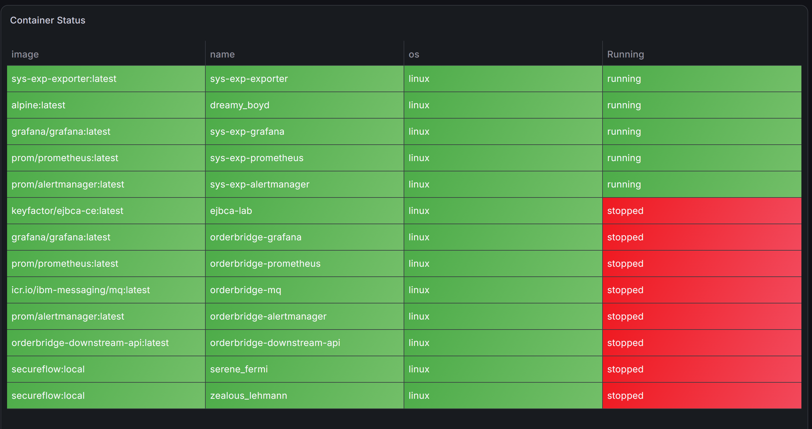
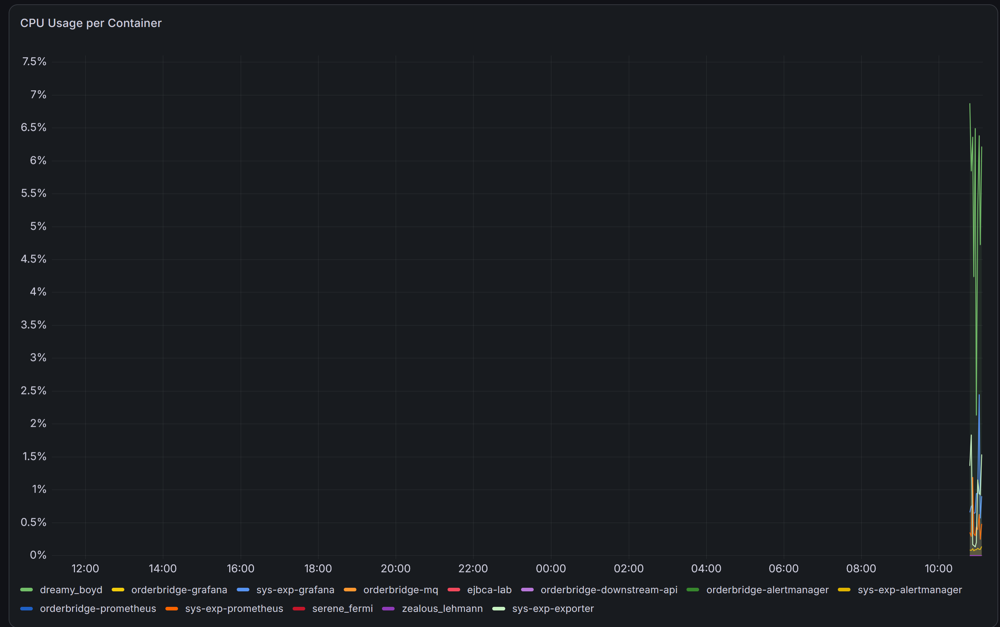
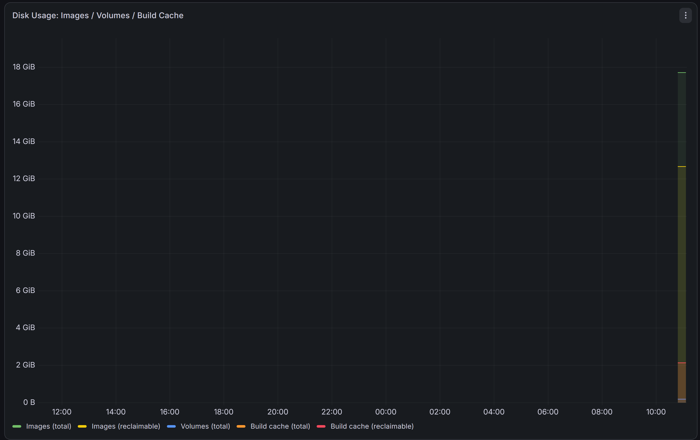
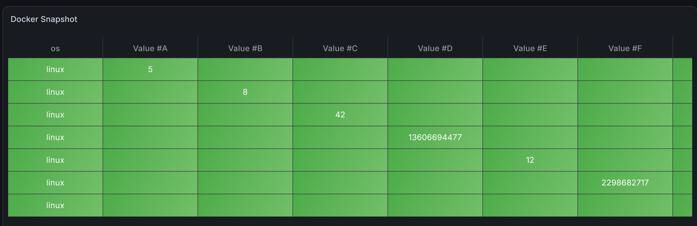

# docker-exp

A small Prometheus exporter for Docker Engine resource usage — the numbers
behind `docker system df` and `docker stats`, as metrics: image/container/
volume/build-cache counts and disk usage, plus per-container CPU and memory.

Split out from [sys-exp](https://github.com/by-tayo/sys-exp) (a host-level
system metrics exporter) because this is a different concern with a
different privilege footprint: it needs read access to `/var/run/docker.sock`
(root-equivalent on the host), which a plain CPU/memory/disk exporter has no
business requiring.


## Screenshots






## Metrics

| Metric | Meaning |
|---|---|
| `docker_exporter_up` | 1 if the Docker Engine API is reachable |
| `docker_containers{state}` | Container count, by `running`/`stopped` |
| `docker_images_total` / `_size_bytes` / `_reclaimable_bytes` | Image count and disk usage; reclaimable = unused by any container |
| `docker_volumes_total` / `_size_bytes` / `_reclaimable_bytes` | Volume count and disk usage; reclaimable = unattached |
| `docker_build_cache_size_bytes` / `_reclaimable_bytes` | Build cache disk usage; reclaimable = not currently in use |
| `docker_container_cpu_percent{name,image}` | Per-container CPU % |
| `docker_container_memory_bytes{name,image}` | Per-container memory usage |
| `docker_container_running{name,image}` | 1 if that container is running |

REST equivalents: `/api/docker` (full snapshot), `/health`, Swagger docs at `/docs`.

## Running standalone

```bash
docker compose up --build
```

| Service | URL |
|---|---|
| Exporter API | http://localhost:8010/docs |
| Metrics | http://localhost:8010/metrics |

Or without Docker Compose:

```bash
pip install -r requirements.txt
python main.py --port 8010
```

## Wiring into an existing Prometheus/Grafana (recommended)

This project deliberately doesn't bundle its own Prometheus/Grafana/
Alertmanager — if you already run a stack (e.g. `sys-exp`'s), point it at
this exporter instead of standing up a second one:

1. **Scrape config** — add a job to your Prometheus config:
   ```yaml
   - job_name: "docker-exp"
     static_configs:
       - targets: ["docker-exp-exporter:8010"]   # or host:8010 outside Docker
   ```
   If your Prometheus and this exporter are both in `docker-compose.yml`
   services on the same Docker network, use the service name (as above).
   Otherwise use `host.docker.internal:8010` (Docker Desktop) or the host IP.

2. **Alert rule** — copy the rule in `alert_rules.yml` into your existing
   `rule_files` (or add it as an additional `rule_files` entry pointing at
   this repo's copy).

3. **Grafana dashboard** — drop `grafana/docker-exp-overview.json` into your
   Grafana's dashboard provisioning directory.

## Performance note

Per-container CPU/memory needs one blocking `stats(stream=False)` call per
running container (~1s each against Docker Desktop's socket proxy). These
are fetched concurrently so a `/metrics` scrape stays fast regardless of
container count, but if you're scraping this alongside a lot of containers,
give the `docker-exp` job a longer `scrape_interval`/`scrape_timeout` than
your other jobs — 30s/25s has been reliable in testing.

## Known limitations

* Image/volume/build-cache **total size** figures sum each entry's reported
  `Size` directly; shared layers across images aren't de-duplicated, so
  totals run a bit higher than `docker system df`'s CLI output (which does
  de-duplicate). Reclaimable figures aren't affected by this.
* Requires the Docker Engine API to be reachable at the default socket
  (`/var/run/docker.sock`) — remote Docker hosts or non-default socket paths
  aren't currently configurable via env var.
